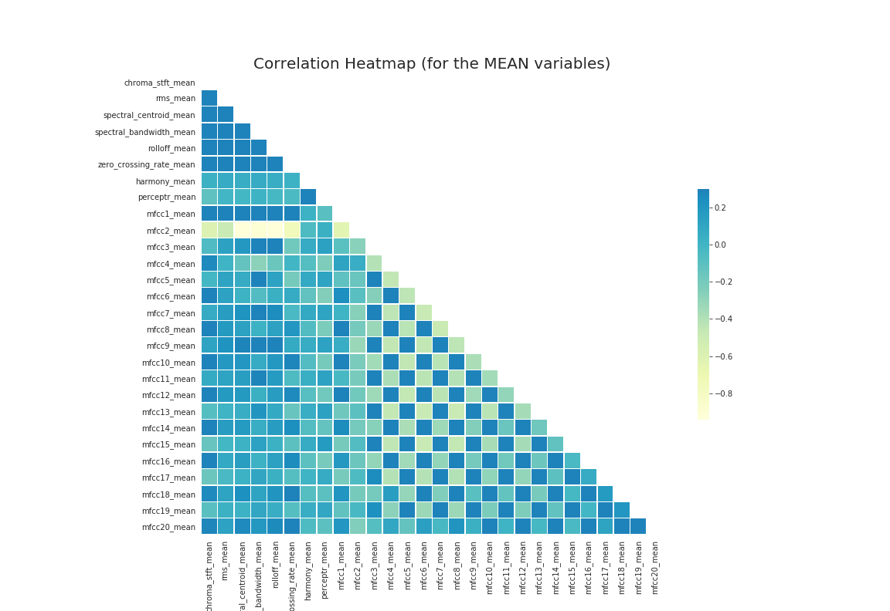
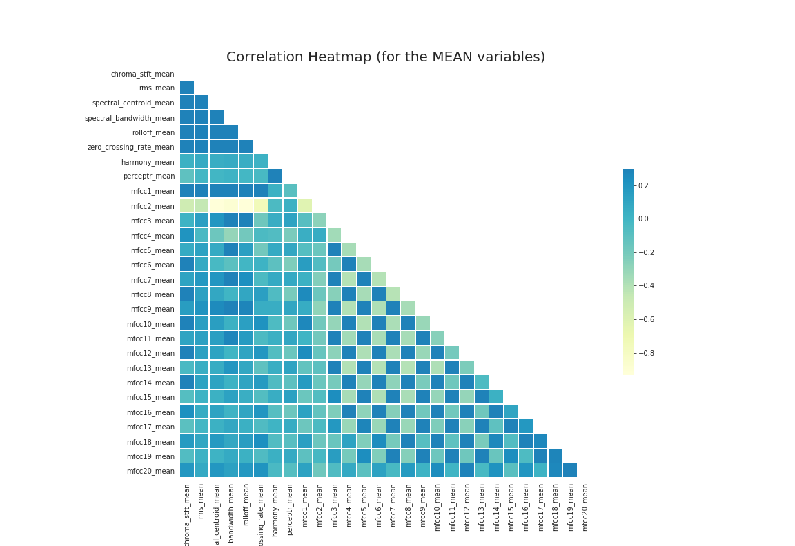

# Music-Genre-Classification

## Abstract
We continually strive to improve our music experience by exploring different resources. We started our music journey with radio programs and television channels and gradually used infamous websites to offline access music. Now, with the streaming platforms, we have achieved the “epitome” of satisfaction, yet, sometimes, whenever we try to explore new music, the streaming platforms cannot provide an entirely satisfactory experience to users.

We have a quandary approach towards segregating our music based on genres and style. Our objective then became to resolve this by applying machine learning techniques to categorize or cluster the music into genres and provide a mechanism for the user to explore new music based on it. By referring to many models already existing on the internet and other resources, we aim to incorporate a comprehensive range of music tastes. We do not seek to solve the issue but take a step towards an even better experience.

## Introduction
We aim to address music classification into specific musical genres through our model and further extend this into practical applications. For this, we have done a thorough research and preprocessing by displaying the human as well as computer-interpreted graphs and labels. This is accompanied by clustering and an overall idea of the music we are dealing with in our dataset. We further propose Multi Classification models for the provided music dataset to categorize it into specific music genres. We have analyzed and tested 7-8 machine learning models and thoroughly experimented to achieve the best achievable performance, including hyperparameter tuning and a performance report. We aim to pick the best model and use it for our further research and implementation.

## Dataset Description
We are using the __GTZAN__ dataset which contains a total of 1000 audio files in .wav format divided into 10 genres. Each genre has 100 songs of 30-sec duration. Along with the audio files, 2 CSV files containing features of the audio files. The files contain mean and variance calculated over multiple features that can be obtained from an audio file. The other file has the same composition, but the songs were divided into 3-second audio files. 

### Audio signal feature extraction:
We convert every audio file to signals with a sampling rate to analyze its characteristics. 
Every waveform has its features in ttwo forms:

- Time domain- nothing much information about music quality can be extracted and explored apart from visual distinction in the waveforms

- Frequency domain which we get after fourier transform of two types: Spectral features and Rhythm features
#### Spectral

#### Rhythm features

MFCC and Rhythm feature plots provide a matrix based information for the unique features. Both the features have been mapped with the duration of the music file.

### Preprocessing
After extraction of features, all columns were not null. So extra values were not added.
Why is it important to preprocess the data?
- The variables will be transformed to the same scale.
- So that all continuous variables contribute equally 
- Such that no biased results 
- PCA very sensitive to variances of initial variables
 If large variance range difference between features , the one with larger range will dominate
- The boxplots of each feature shows some features have very large differences in their variances.
- PCA with both normalisation(minMaxScaler) and standardisation(StandardScaler) is done and difference noted.
 
 ## Methodology
 Feature extraction -> correlation matrix -> PCA
 - With 30 secs sample
 
 
 - With 3 secs sample

- Less outliers/ variance for some classes found in principal components:

#### Inferences till this step:
- pca.explained_variance_ratio_=[0.20054986 0.13542712]
Shows pc1 holds 20% percent of the data, pc2 holds 13% of the data
- Big clusters of metal , rock, pop ,reggae, classical can be seen.
- Jazz ,country, are separable to one extent.
- Hip-hop,disco,blues are very dispersed and can’t be seen 
- Majority are easily separable classes
- Decided to proceed to modelling phase by using 3 sec sampled feature set with standardization as it aggregated the genres into more linearly separable clusters than normalisation

## Classification:
### Logistic
This model is a predictive analysis algorithm based on the concept of probability. GridSearchCV was used to pass all combinations of hyperparameters one by one into the model and the best parameters were selected. 

Without Hyperparameter tuning:

|Metric          |  Value                        |
|:---            |                           ---:|  
|Accuracy score|0.67267|
|Precision|0.74126|
|Recall|0.74098|

Using Hyperparameter tuning:

|Metric          |  Value                        |
|:---            |                           ---:|  
|Accuracy score|0.70504|
|Precision|0.70324|
|Recall|0.71873|

### SGD Classifier
Took SGD as baseline model and performed hyperparameter tuning for a better performance.Though difference werent that great even after HP tuning.

|Metric          |  Value                        |
|:---            |                           ---:|  
|Accuracy score| 0.6441441441441441|
|Precision|0.6386137102787109|
|Recall|0.6421140902032518|

### Gaussian NB
We used a Simple Naive Bayes classifier, one vs Rest Naive Bayes as baseline models.
Then used Hyperparameter testing to get better performance.

Best parameters : 
|Metric          |  Value                        |
|:---            |                           ---:|  
|Accuracy score|0.468968968968968951|
|Precision|0.4606482379884576|
|Recall|0.4755693757933862|

### KNN
This model almost outperformed compared to Gaussian NB models. 
As we can see , after HP tuning , correlation between the features has decreased, some had even 0 correlation.

Without Hyperparameter tuning:

|Metric          |  Value                        |
|:---            |                           ---:|  
|Accuracy score|0.8603603603603603|
|Precision|0.8594536380364758|
|Recall|0.8583135066852872|

Using hyperparameter tuning :

|Metric          |  Value                        |
|:---            |                           ---:|  
|Accuracy score|0.9059059059059059|
|Precision|0.9073617032054686|
|Recall|0.905944266718195|

### Decision Trees
- Took DT as baseline model which didnt give great results, with accuracy around 65%.

|Metric          |  Value                        |
|:---            |                           ---:|  
|Accuracy score| 0.637758505670447|
|Precision|0.6396387192624916|
|Recall|0.6376582879474517|

- Used ADA boosting which reduced the performance(rock,pop,disco)

|Metric          |  Value                        |
|:---            |                           ---:|  
|Best parameters| n_estimators=100|
|Accuracy score| 0.5010006671114076|
|Precision| 0.48730102839842837|
|Recall|0.4992406459587978|

- Then gradient boosting which increased the accuracy exponentially.

|Metric          |  Value                        |
|:---            |                           ---:|  
|Best parameters| n_estimators=100|
|Accuracy score| 0.8238825883922615|
|Precision| 0.8266806080093154|
|Recall|0.8232200760446549|

- CatBoost was having high AUC for all genres unlike gradient which had low accuracy for some genres

- Cat boost outperformed ensemble methods. Gradient boost was close enough with 82% accuracy, rest all were in between 50-60%

|Metric          |  Value                        |
|:---            |                           ---:|  
|Best parameters| loss function:”Multiclass”|
|Accuracy score| 0.8972648432288192|
|Precision| 0.8979267969111706|
|Recall|0.8972734276109252|

### Random Forest
- As shown here RF was having around 80% accuracy but XGB boosting reduced the accuracy to 75%

|Metric          |  Value                        |
|:---            |                           ---:|  
|Best parameters |n_estimators=1000 max_depth=10|
|Accuracy score  |0.8038692461641094             |
|Precision       |0.805947955999254              |
|Recall          |0.8026467091527609             |

- Cross Gradient Boosting on Random Forest reduced the accuracy , it even reduced precision ,recall to large extent.

|Metric          |  Value                        |
|:---            |                           ---:|  
|Best parameters |objective= 'multi:softmax'|
|Accuracy score  | 0.7505003335557038            |
|Precision       |     0.7593347049139745     |
|Recall          |0.7494976488750396           |

### XGB Classifier
- Correlation matrix shows there is very less correlation among variables

- Best performed model among all DT and RF models with every genre was classified with atleast 85+% accuracy 
- Genres like classical,hiphop had even 100% accuracy
- XGBoost improves upon the basic Gradient Boosting Method framework through systems optimization and algorithmic enhancements.
- Evaluations

|Metric          |  Value                        |
|:---            |                           ---:|  
|Best parameters |learning rate:0.05, n_est =1000|
|Accuracy score  |0.9072715143428952            |
|Precision       |0.9080431364823143             |
|Recall          |0.9072401472896423            |

### MLP
This model is an Artificial Neural Network involving multiple layers and each layer has a considerable number of activation neurons. The primary training included random values of hyperparameters except the activation function . This initiation reflected overfitting in the data for different activation functions :  

|Activation |  Training Accuracy  |  Testing Accuracy  | 
|:---       |                 ---:|                ---:|
|relu       |0.9887142777442932   |0.5206666588783264  | 
|sigmoid    |0.941428542137146    |0.4970000088214874  |
|tanh       |0.9997143149375916   |0.49266666173934937 |
|softplus   |0.9991428852081299   | 0.5583333373069763 |

From the following graph, we choose softplus to be the best activation function, considering softmax to be fixed for output  
Upon looking the graph, we can conclude a very high variance in testing and training accuracy and so we know that our model is overfitting. In fact the testing loss starts to increase which indicates a high cross entropy loss. This will be dealt later. For now we see that softplus, relu and sigmoid, all 3 have performed similar on training and testing set thus we will go with softplus since it provides a little less variance than others.

#### Hyperparameter tuning has been done manually by manipulating the following metrics: 
- Learning rate  
activation = softmax  
no. of hidden layers = 3; neurons in each = [512,256,64]  
activation of output layer is fixed to be softmax epochs = 100  

|Learning Rate |  Training Accuracy  |  Testing Accuracy  | 
|:---          |                 ---:|                ---:|
|0.01          |0.4044285714626312   |0.335999995470047   | 
|0.001         |0.9888571500778198   |0.5666666626930237  |
|0.0001        |0.9684285521507263   |0.5513333082199097  |
|0.00001       |0.7134285569190979   |0.4996666610240936  |

From the above graphs we see that 0.01 definitely results in over convergence and bounces as reflective from the accuracy graph. 0.001 has a very high variance and loss increases margianally with low acuracy so it isn't appropriate as well.  

The best choice for alpha is either 0.0001 or 0.00001.  
0.00001 has a relatively low variance and loss converges quickly with epochs but accuracy on training and testing set is pretty low.  
0.0001 has a better performance but variance is very high

- no.of hidden layers  
activation = softmax  
learning rate = 0.0001  
activation of output layer is fixed to be softmax epochs = 100  

|Number of layers|  Training Accuracy  |  Testing Accuracy  | 
|:---            |                 ---:|                ---:|
|2               |0.9782857298851013   |0.5383333563804626   | 
|3               |0.9869999885559082   |0.5443333387374878  |
|4               |0.9921428561210632   |0.5506666898727417  |

In conclusion, increasing or decreasing the number of layers have no effect on variance. This is because we have too many neurons per layer. So we take 3 layers and reduce the number of neurons. 

- Number of neurons
- regularization and decomposition etc
### SVM
This model outperformed every other model and gave the best accuracy. Manual hyperparameter tuning was done. Linear, polynomial and RBF  kernel were compared using confusion matrix.

#### Best Linear Kernel Model: 

|Metric          |  Value                        |
|:---            |                           ---:|  
|Best parameters |C=1.0,kernel='linear',random_state=0|
|Accuracy score  |0.70672342343265456            |
|Precision       |0.7180431364823143             |
|Recall          |0.71234655872896242            |

#### Best Polynomial Kernel Model: 

|Metric          |  Value                        |
|:---            |                           ---:|  
|Best parameters |C=1.0,kernel='poly',degree=7|
|Accuracy score  |0.88242715143428952            |
|Precision       |0.8780431364823143             |
|Recall          |0.87035601472896557            |

#### Best RBF Kernel Model: 

|Metric          |  Value                        |
|:---            |                           ---:|  
|Best parameters |C=200,kernel='rbf',gamma=4|
|Accuracy score  |0.9424715143428952            |
|Precision       |0.939297323879391             |
|Recall          |0.9372401472896423            |

## Conclusions:
- SVMs performed the best among all classifiers with 94% accuracy
- Gaussian outperformed polynomial kernel in almost all iterations
- XGB classifiers were the best among all ensembling methods with 90% accuracy.
- Since genre classes were balanced , the tradeoff between precision and recall was less observed.
- Among all KNN,DT and ensemble classifiers , precision was more than recall
- While in case of LR,SGD,NB,MLP,SVM recall was observed more than precision.
